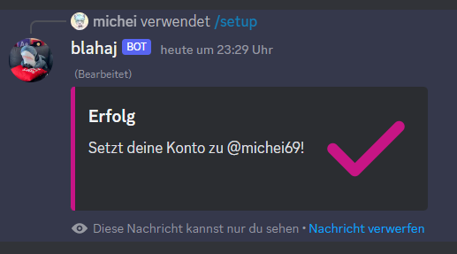
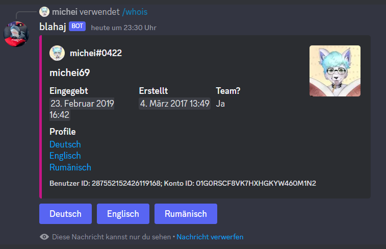
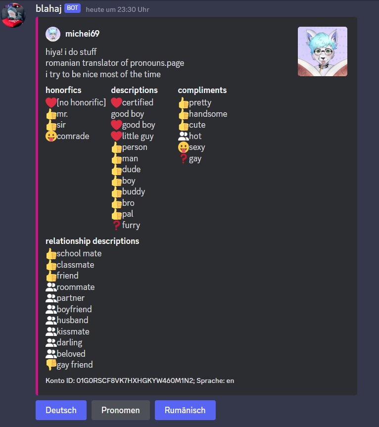

# Pronouns.Page discord bot

work in progress

## stuff implemented:
- SUML support out of the box for discord-supported locales
- Pronouns.Page API wrapper (found in `./src/api/PronounsPage.ts`)
- decent embeds
- profile fetching
- a ping command 😊

## to do:
- fix temp bans
- add more try-catches/verify more inputs (esp. for locales)
- add/complete translations both in code and in `./src/locales`
- REWRITE FETCH PROFILE AND FETCH WORDS CAUSE THOSE DAMN IF-ELSES ARE KILLING MY EYES
- also fix both of them cause they're broken when not enough languages (prob due to too many if-elses at this point)

## ideas/stuff to implement:
- more moderation tools (log, etc.)
- the damn mute command cause its useful
- OAuth with pronouns.page itself? (right now its based off of truthness lol)
- funstuff or other functions?

## more photos

